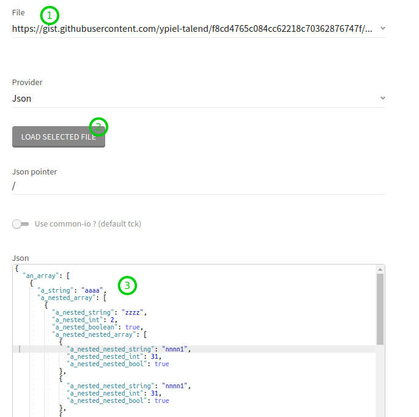
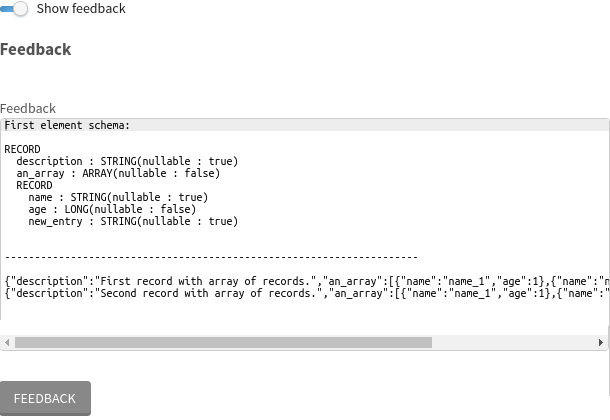

= Record generator
:toc:
:toclevels: 4

== Main features
This connector proposes several record providers to generate records. Here are currently supported record providers:

- *Empty* : generates no record at all
- *Beanshell* : _you can code in java_ your records generation. It is very useful to easily reproduce a specific record to reproduce a use case. You are able to create records directly using TCK api. The limitation is that you have to use java 4 syntax (_no generics nor lambda_).
- *Json* : you can give a json content that will be converted to record y tck itself, or by common-stream-io connectors-se library. So you can reproduce use cases of any connectors using this library (should be all connectors that deal with json)
- *Fixed record* : It generates _n_ records with fixed schema. All types supported by TCK are in the record. Null value is set cyclically to all attributes. Min and max values are set for numbers

You can load json or beanshell code from resource file of the record, or from an HTTP call, so you can save your json or beanshell code in https://gist.github.com/ for instance:

Another great feature is that you can generate and see generated records directly at design time. No need to create a pipeline, nor execute it, to check generated records. The schema of the first record is also displayed:

Since this connector is to make tests, we wanted to configure it the simplest way it can. So, the dataset configuration can be overwritten in designer. No need to go back to dataset, update/save, come back to pipeline, to take effect. Just edit the configuration in the designer view:

image::images/overwrite_dataset.png[]

== How to add in a Remote Engine Gen2
=== Build the connector
- First, clone the connectors-se repository
----
git clone git@github.com:Talend/connectors-se.git
----
- Build the connector
----
mvn clean install -pl record-tester -am -DskipTests
----
=== Customize the REG2
I this example I use eap environment.

- Go into your REG2 installation folder
- Customize your connectors image
----
docker run -v $(pwd)/eap/:/re4p/ -v /home/${USER}/dev/connectors-se/record-tester/target/:/car/ -v /var/run/docker.sock:/var/run/docker.sock tacokit/remote-engine-customizer:1.1.18 register-component-archive --component-archive=/car/recordtester-x.y.z-SNAPSHOT.car --remote-engine-dir=/re4p/ --from-image-type=DOCKER
----
- Restart your REG2
----
./remote-engine.sh restart -r at -k <key>
----
- In eap_component-server_1 container you should see this log without error
----
~/Talend/RE_TPD/remote-engine-gen-2-2020-12$ docker logs eap_component-server_1

[...]
[2021-01-13T17:18:47,457][INFO ][           main][ent.container.ContainerManager] Created container recordtester
[...]
----

== How to use ?
=== Create connection
First, create a connection and select '_Record generator_' connection type.

There no configuration at all in the connection.

=== Create a dataset
Then, create a dataset using the connection created above.

image::images/dataset_form.png[]

- split : It will generate _n_ worker. All records are generated on all workers
- File : A file to load in the below text area. The content should be compatible with the selected provider
- Provider : The provider generates the records. It canbe from json, java code or fixed schema records

==== Json provider
You will have some additional parameters for json provider :

- Json pointer : You can define a json pointer to only compute a sub part of the json content. If it is an array, it will generate a record by item
- Use common-io : A connector can return a json object. This is the default. In that case it is the TCK framework that will convert the json object to record. If we select this option, _common-stream-io/stream-json_ will be used. Currently our efforts are on this library. So there could be some differences between the json2record from this library and the one from tck.

==== Beanshell provider
This provider relies on beanshell library : https://beanshell.github.io/
It allows you to define script in a java syntax that can be interpreted at reuntime. It can also bind variable to you execution environment.
So the beanshell script will have access to the provider itself by the _provider_ variable. Since this provider extends AbstractProvider, the script will be able to use help methods like _newRecordEntry_ or _newArrayEntry_...
https://github.com/Talend/connectors-se/blob/2473634e4a4e7ef3da29e5e5b141a4babad41878/record-tester/src/main/java/org/talend/components/recordtester/service/AbstractProvider.java#L54

Records has to be added in the _records_ list. Here is an example:

----
// This is a beancshell script : http://www.beanshell.org/manual/contents.html
// /!\ Only syntax java 1.4 is supported (no generics !)
// provider is instance of org.talend.components.recordtester.service.generic.Beanshell

getRecord(int i){

    Record.Builder builder = provider.getRecordBuilderFactory().newRecordBuilder();
    builder = builder.withString("name", "name_"+i)
                        .withInt("age", i);
    if(i > 1){
        // The second record contains a new entry that is not in the first schema
        builder = builder.withString("new_entry", "value");
    }

    return builder.build();
}

for(int i = 1; i <= 2; i++){
records.add(getRecord(i));
}
----

Here is the generated record in the feedback field:

image::images/feedback_beanshell.png[]

==== Fixed record provider
- Nb record to generate : how many records you want to generates on each worker

There is no more parameter since record schema is fixed. If wet set 15 and then ask for the feedback we will get:

----
First element schema:

RECORD
  split : INT(nullable : true)
  thread : STRING(nullable : true)
  a_string : STRING(nullable : true)
  a_boolean : BOOLEAN(nullable : true)
  a_int : INT(nullable : true)
  a_long : LONG(nullable : true)
  a_float : FLOAT(nullable : true)
  a_double : DOUBLE(nullable : true)
  a_datetime : DATETIME(nullable : true)
  a_byte_array : BYTES(nullable : true)
  a_string_array : ARRAY(nullable : true)
  STRING
  a_record : RECORD(nullable : true)
  RECORD
    rec_string : STRING(nullable : true)
    rec_int : INT(nullable : true)

---------------------------------------------------------------------

{"split":-1,"thread":"https-jsse-nio-443-exec-10-28","a_string":"string_1","a_boolean":true,"a_int":-2147483648,"a_long":-9223372036854775808,"a_float":1.401298464324817E-45,"a_double":4.9E-324,"a_datetime":"2001-04-10T00:00:00Z[UTC]","a_byte_array":"aW5kZXhfMQ==","a_string_array":["aaaa1","bbbb1","cccc1","dddd1","eeee1"],"a_record":{"rec_string":"rec_string_1","rec_int":1}}
{"split":-1,"thread":"https-jsse-nio-443-exec-10-28","a_boolean":false,"a_int":2147483647,"a_long":9223372036854775807,"a_float":3.4028234663852886E+38,"a_double":1.7976931348623157E+308,"a_datetime":"2002-04-10T00:00:00Z[UTC]","a_byte_array":"aW5kZXhfMg==","a_string_array":["aaaa2","bbbb2","cccc2","dddd2","eeee2"],"a_record":{"rec_string":"rec_string_2","rec_int":2}}
{"split":-1,"thread":"https-jsse-nio-443-exec-10-28","a_string":"string_3","a_int":-2147483648,"a_long":-9223372036854775808,"a_float":1.401298464324817E-45,"a_double":4.9E-324,"a_datetime":"2003-04-10T00:00:00Z[UTC]","a_byte_array":"aW5kZXhfMw==","a_string_array":["aaaa3","bbbb3","cccc3","dddd3","eeee3"],"a_record":{"rec_string":"rec_string_3","rec_int":3}}
{"split":-1,"thread":"https-jsse-nio-443-exec-10-28","a_string":"string_4","a_boolean":false,"a_long":9223372036854775807,"a_float":3.4028234663852886E+38,"a_double":1.7976931348623157E+308,"a_datetime":"2004-04-10T00:00:00Z[UTC]","a_byte_array":"aW5kZXhfNA==","a_string_array":["aaaa4","bbbb4","cccc4","dddd4","eeee4"],"a_record":{"rec_string":"rec_string_4","rec_int":4}}
{"split":-1,"thread":"https-jsse-nio-443-exec-10-28","a_string":"string_5","a_boolean":true,"a_int":-2147483648,"a_float":1.401298464324817E-45,"a_double":4.9E-324,"a_datetime":"2005-04-10T00:00:00Z[UTC]","a_byte_array":"aW5kZXhfNQ==","a_string_array":["aaaa5","bbbb5","cccc5","dddd5","eeee5"],"a_record":{"rec_string":"rec_string_5","rec_int":5}}
{"split":-1,"thread":"https-jsse-nio-443-exec-10-28","a_string":"string_6","a_boolean":false,"a_int":2147483647,"a_long":9223372036854775807,"a_float":3.4028234663852886E+38,"a_double":1.7976931348623157E+308,"a_datetime":"2006-04-10T00:00:00Z[UTC]","a_byte_array":"aW5kZXhfNg==","a_string_array":["aaaa6","bbbb6","cccc6","dddd6","eeee6"],"a_record":{"rec_string":"rec_string_6","rec_int":6}}
{"split":-1,"thread":"https-jsse-nio-443-exec-10-28","a_string":"string_7","a_boolean":true,"a_int":-2147483648,"a_long":-9223372036854775808,"a_float":1.401298464324817E-45,"a_datetime":"2007-04-10T00:00:00Z[UTC]","a_byte_array":"aW5kZXhfNw==","a_string_array":["aaaa7","bbbb7","cccc7","dddd7","eeee7"],"a_record":{"rec_string":"rec_string_7","rec_int":7}}
{"split":-1,"thread":"https-jsse-nio-443-exec-10-28","a_string":"string_8","a_boolean":false,"a_int":2147483647,"a_long":9223372036854775807,"a_float":3.4028234663852886E+38,"a_double":1.7976931348623157E+308,"a_datetime":"2008-04-10T00:00:00Z[UTC]","a_byte_array":"aW5kZXhfOA==","a_string_array":["aaaa8","bbbb8","cccc8","dddd8","eeee8"],"a_record":{"rec_string":"rec_string_8","rec_int":8}}
{"split":-1,"thread":"https-jsse-nio-443-exec-10-28","a_string":"string_9","a_boolean":true,"a_int":-2147483648,"a_long":-9223372036854775808,"a_float":1.401298464324817E-45,"a_double":4.9E-324,"a_byte_array":"aW5kZXhfOQ==","a_string_array":["aaaa9","bbbb9","cccc9","dddd9","eeee9"],"a_record":{"rec_string":"rec_string_9","rec_int":9}}
{"split":-1,"thread":"https-jsse-nio-443-exec-10-28","a_string":"string_10","a_boolean":false,"a_int":2147483647,"a_long":9223372036854775807,"a_float":3.4028234663852886E+38,"a_double":1.7976931348623157E+308,"a_datetime":"2010-04-10T00:00:00Z[UTC]","a_string_array":["aaaa10","bbbb10","cccc10","dddd10","eeee10"],"a_record":{"rec_string":"rec_string_10","rec_int":10}}
{"split":-1,"thread":"https-jsse-nio-443-exec-10-28","a_string":"string_11","a_boolean":true,"a_int":-2147483648,"a_long":-9223372036854775808,"a_float":1.401298464324817E-45,"a_double":4.9E-324,"a_datetime":"2011-04-10T00:00:00Z[UTC]","a_byte_array":"aW5kZXhfMTE=","a_record":{"rec_string":"rec_string_11","rec_int":11}}
{"split":-1,"thread":"https-jsse-nio-443-exec-10-28","a_string":"string_12","a_boolean":false,"a_int":2147483647,"a_long":9223372036854775807,"a_float":3.4028234663852886E+38,"a_double":1.7976931348623157E+308,"a_datetime":"2012-04-10T00:00:00Z[UTC]","a_byte_array":"aW5kZXhfMTI=","a_string_array":["aaaa12","bbbb12","cccc12","dddd12","eeee12"]}
{"split":-1,"thread":"https-jsse-nio-443-exec-10-28","a_string":"string_13","a_boolean":true,"a_int":-2147483648,"a_long":-9223372036854775808,"a_float":1.401298464324817E-45,"a_double":4.9E-324,"a_datetime":"2013-04-10T00:00:00Z[UTC]","a_byte_array":"aW5kZXhfMTM=","a_string_array":["aaaa13","bbbb13","cccc13","dddd13","eeee13"],"a_record":{"rec_string":"rec_string_13","rec_int":13}}
{"split":-1,"thread":"https-jsse-nio-443-exec-10-28","a_string":"string_14","a_boolean":false,"a_int":2147483647,"a_long":9223372036854775807,"a_float":3.4028234663852886E+38,"a_double":1.7976931348623157E+308,"a_datetime":"2014-04-10T00:00:00Z[UTC]","a_byte_array":"aW5kZXhfMTQ=","a_string_array":["aaaa14","bbbb14","cccc14","dddd14","eeee14"],"a_record":{"rec_string":"rec_string_14","rec_int":14}}
{"split":-1,"thread":"https-jsse-nio-443-exec-10-28","a_boolean":true,"a_int":-2147483648,"a_long":-9223372036854775808,"a_float":1.401298464324817E-45,"a_double":4.9E-324,"a_datetime":"2015-04-10T00:00:00Z[UTC]","a_byte_array":"aW5kZXhfMTU=","a_string_array":["aaaa15","bbbb15","cccc15","dddd15","eeee15"],"a_record":{"rec_string":"rec_string_15","rec_int":15}}
----

- You can see that each field is null on after the second, the first record contains all fields.
- Numbers alternates with their min and their max
- The split number and the thread id are also part of the record

=== Use it in a pipeline
The dataset you have created is available to be selected as source of a pipeline. Once you have selected it you can use it with the configuration set in dataset, but, you can also overwrite the configuration.

- Select the input connector
- In the configuration panel, select 'Overwrite dataset'
- You can configure the connector. This configuration will be used and not the one from the dataset
